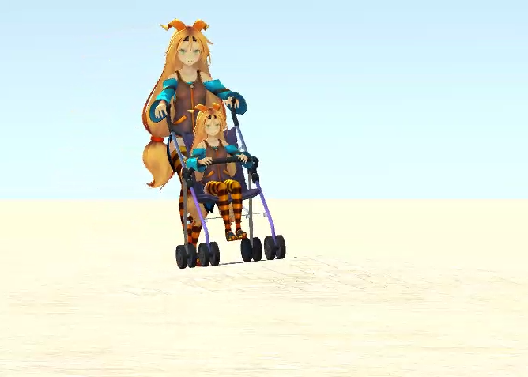

# Unity humanoid

## Background

I have been a digital-twin creator since year 2020.

I am working on human movement simulations these days. This project is a collection of my works in my spare time to learn 3D animations with Unity.

## Demo video

### My channel on YouTube

- [Unity-chan pushing a baby stroller](https://youtu.be/cl6UpGPZEys)
- [Ladder climbing](https://youtu.be/gcNkXm_A9H8)

### Other videos

- [A baby car stuck in a door](./demo/StuckInTheDoor.mp4)

## Projects

Requirements: [Unity-Chan!](https://assetstore.unity.com/packages/3d/characters/unity-chan-model-18705) and [Standard Assets](https://assetstore.unity.com/packages/essentials/asset-packs/standard-assets-for-unity-2018-4-32351)

- [Baby stroller](./unity/BabyStroller)
- [Ladder climbing](./unity/LadderClimbing)

## My original 3D models with Blender

- [3D models](/blender)

## References

### Mixamo

I have used animation clips and a 3D model "Stefani" from Mixamo in this project: https://www.mixamo.com/

### CC0Textures

I have used textures from this site: https://cc0textures.com/
